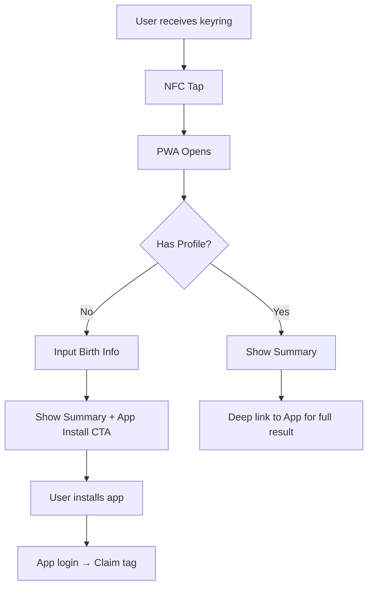
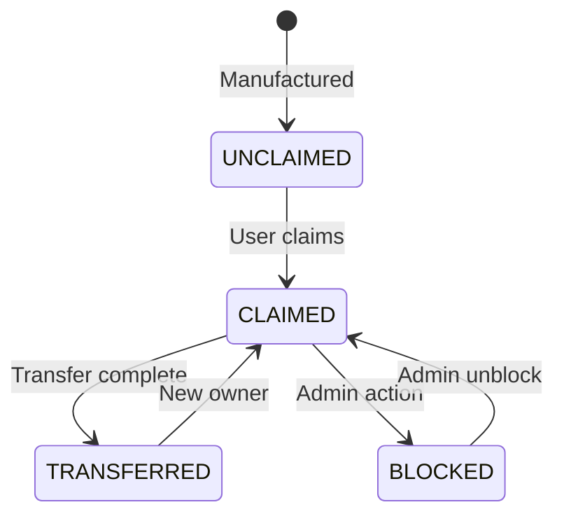

# NFC TagId Operations Guide

## Overview

This document covers the complete lifecycle of NFC tags from manufacturing to end-user transfer for the EF (이프) keyring product.

---

## 1. Tag ID Specification

### Format
- **Length**: 16 characters
- **Charset**: URL-safe Base64 (`A-Za-z0-9_-`)
- **Example**: `xK9mP3nQ7vR2wB4t`

### Generation
```typescript
import crypto from 'crypto';

function generateTagId(): string {
  return crypto.randomBytes(12)
    .toString('base64url')
    .substring(0, 16);
}
```

---

## 2. Database Schema

### Tag Table
```sql
CREATE TABLE tags (
  id UUID PRIMARY KEY DEFAULT gen_random_uuid(),
  tag_id VARCHAR(16) UNIQUE NOT NULL,
  status VARCHAR(20) NOT NULL DEFAULT 'UNCLAIMED',
  batch_id UUID REFERENCES tag_batches(id),
  owner_user_id UUID REFERENCES users(id),
  claimed_at TIMESTAMP,
  last_scan_at TIMESTAMP,
  blocked_reason TEXT,
  created_at TIMESTAMP DEFAULT NOW(),
  updated_at TIMESTAMP DEFAULT NOW()
);

-- Status enum: UNCLAIMED, CLAIMED, BLOCKED, TRANSFERRED
CREATE INDEX idx_tags_status ON tags(status);
CREATE INDEX idx_tags_owner ON tags(owner_user_id);
```

### Tag Batch Table
```sql
CREATE TABLE tag_batches (
  id UUID PRIMARY KEY DEFAULT gen_random_uuid(),
  batch_name VARCHAR(100) NOT NULL,
  quantity INT NOT NULL,
  manufactured_at DATE,
  notes TEXT,
  created_at TIMESTAMP DEFAULT NOW()
);
```

### Tag Transfer Table
```sql
CREATE TABLE tag_transfers (
  id UUID PRIMARY KEY DEFAULT gen_random_uuid(),
  tag_id UUID REFERENCES tags(id) NOT NULL,
  transfer_code VARCHAR(8) UNIQUE NOT NULL,
  from_user_id UUID REFERENCES users(id) NOT NULL,
  to_user_id UUID REFERENCES users(id),
  expires_at TIMESTAMP NOT NULL,
  used_at TIMESTAMP,
  created_at TIMESTAMP DEFAULT NOW()
);

-- Transfer code: 8-char alphanumeric
CREATE INDEX idx_transfers_code ON tag_transfers(transfer_code);
CREATE INDEX idx_transfers_expires ON tag_transfers(expires_at);
```

---

## 3. Operations Workflow

### 3.1 Pre-Production: Batch Creation


**Admin API**:
```http
POST /admin/batches
{
  "batchName": "Tumblbug-Jan2026",
  "quantity": 1000,
  "notes": "텀블벅 1차 펀딩 배송분"
}
```

**Response**:
```json
{
  "batchId": "uuid",
  "csvUrl": "/downloads/batch-uuid.csv"
}
```

**CSV Format**:
```csv
tagId,nfcUrl,qrCode
xK9mP3nQ7vR2wB4t,https://redirect.rsr41.com/t/xK9mP3nQ7vR2wB4t,<QR_DATA>
...
```

### 3.2 Manufacturing

1. NFC chip encoded with URL: `https://redirect.rsr41.com/t/{tagId}`
2. QR code printed on packaging (backup access)
3. TagId printed on packaging (for manual entry)

### 3.3 Quality Control (QC)

**Test checklist**:
- [ ] NFC tap opens correct URL on iOS
- [ ] NFC tap opens correct URL on Android
- [ ] QR code scans correctly
- [ ] Redirect reaches PWA
- [ ] TagId matches batch records

### 3.4 Shipping & First Use



### 3.5 Tag Claim (App)

**API**:
```http
POST /tags/claim
Authorization: Bearer {token}
{
  "tagId": "xK9mP3nQ7vR2wB4t"
}
```

**Responses**:
- `200 OK`: Tag claimed successfully
- `400 Bad Request`: Tag already claimed by another user
- `404 Not Found`: Invalid tagId

### 3.6 Tag Transfer (Ownership Change)

**Step 1**: Current owner initiates transfer
```http
POST /tags/transfer/create
Authorization: Bearer {token}
{
  "tagId": "xK9mP3nQ7vR2wB4t"
}
```

**Response**:
```json
{
  "transferCode": "ABC12345",
  "expiresAt": "2026-01-26T12:00:00Z"
}
```

**Step 2**: New owner accepts transfer
```http
POST /tags/transfer/accept
Authorization: Bearer {token}
{
  "transferCode": "ABC12345"
}
```

**Effect**:
1. Tag ownership changes to new user
2. **All previous data is deleted** (privacy policy)
3. Transfer code expires
4. Notification sent to previous owner

---

## 4. Tag Status Lifecycle



---

## 5. API Summary

| Endpoint | Method | Auth | Description |
|----------|--------|------|-------------|
| `/public/t/:tagId/initial` | GET | No | Get tag status (unclaimed?) |
| `/public/t/:tagId/summary` | GET | Optional | Get fortune summary |
| `/tags/claim` | POST | Required | Claim unclaimed tag |
| `/tags/transfer/create` | POST | Required | Generate transfer code |
| `/tags/transfer/accept` | POST | Required | Accept transfer |
| `/admin/batches` | POST | Admin | Create new batch |
| `/admin/tags/:tagId/block` | POST | Admin | Block a tag |

---

## 6. Tumblbug/Wadiz Integration

### Pre-Launch
1. Estimate backer count → Generate batch with buffer (e.g., +10%)
2. Test tags from batch
3. Prepare CSV with reward tiers

### During Funding
1. Track stretch goals → May need additional batches
2. Communicate shipping timeline

### Post-Funding
1. Export backer list
2. Generate shipping labels with tagId
3. Send tracking info

### Shipping
1. Include printed setup card with:
   - NFC tap instructions
   - QR code backup
   - App store links
   - Support contact

---

## 7. Data Deletion Policy

When a tag is transferred:
1. ✅ Delete all history records
2. ✅ Delete all face analysis results
3. ✅ Delete all tarot readings
4. ✅ Delete all dream interpretations
5. ✅ Delete profile data
6. ❌ Keep tag metadata (for analytics)

---

## 8. Security Measures

| Risk | Mitigation |
|------|------------|
| TagId guessing | 16-char random ID = 96 bits entropy |
| Transfer code brute force | 8-char + 24h expiry + rate limiting |
| Stolen tag | Owner can transfer away or request block |
| Cloned NFC | Server validates one owner per tagId |
