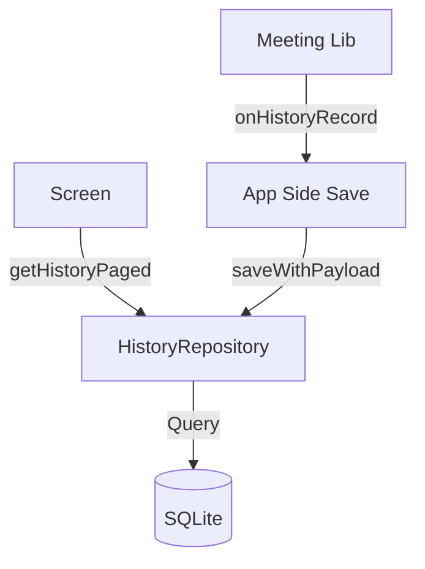

# Repository Map: Oracle Flutter

이 문서는 프로젝트의 주요 구조, 진입 요소 및 데이터 흐름을 빠르게 파악하기 위한 가이드입니다.

## 근거 데이터 (Evidence)
- **탭 구조**: [scaffold_with_navbar.dart](file:///C:/Users/qkrtj/destiny/oracle/apps/flutter/oracle_flutter/lib/app/navigation/scaffold_with_navbar.dart#L18-L57)
- **라우트 트리**: [app_router.dart](file:///C:/Users/qkrtj/destiny/oracle/apps/flutter/oracle_flutter/lib/app/navigation/app_router.dart#L47-L309)
- **DB 계층**: [history_repository.dart](file:///C:/Users/qkrtj/destiny/oracle/apps/flutter/oracle_flutter/lib/app/database/history_repository.dart)

---

## 1. 하단 네비게이션 (Tabs)
`ScaffoldWithNavBar`를 통해 제어되며, `FeatureFlags`에 따라 동적으로 구성됩니다.

| Tab | Route | 활성화 조건 |
| :--- | :--- | :--- |
| **Home** | `/home` | 상시 |
| **Fortune** | `/fortune` | 상시 |
| **Meeting** | `/meeting` | `hasSaju && showBetaFeatures` |
| **Compat** | `/compatibility` | `showBetaFeatures` |
| **History** | `/history` | 상시 |
| **Profile** | `/profile` | 상시 |

## 2. 주요 라우트 트리 (GoRouter)
`ShellRoute`를 기반으로 하며, 베타 기능에 별도의 `redirect` 리다이렉션이 적용되어 있습니다.

- `/home`: 메인 대시보드
- `/fortune`: 운세 카테고리 (오늘의 운세, 캘린더 등)
- `/history`: 전체 히스토리 리스트
  - `/meeting/history`: (중첩) Meeting 전용 히스토리
  - `/meeting/history/detail/:id`: (중첩) 히스토리 상세 (JSON 조회)
- `/meeting`: 소개팅 홈 (Beta)
- `/face`: 관상 (Beta)
- `/tarot`: 타로 (Beta)
- `/dream`: 꿈해몽 (Beta)
- `/fortune-detail`: 사주/운세 일반 상세 결과

## 3. History 데이터 흐름
기록 저장 및 조회는 `HistoryRepository`를 통해 SQLite에 영구 저장됩니다.

- **일반 기록**: `FortuneResult` 모델 기반의 텍스트 요약 저장.
- **상세 기록**: `payload` 필드를 통해 JSON 데이터를 원본 유지하며 저장 (`getPayload(id)`로 조회 가능).

## 4. 핵심 엔트리 포인트
- `lib/main.dart`: 앱 시작점 (AppState 초기화).
- `lib/app/app.dart`: MaterialApp 설정 및 Router 주입.
- `lib/app/state/app_state.dart`: 전역 상태 (i18n, 유저 프로필, 사주 정보).
- `lib/app/config/feature_flags.dart`: 빌드 타임 기능 토글.
